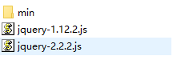

## 什么是jQuery

一个类库 - 一个工具包，别人在里面提供了很多的代码的封装，我们只要学会里面的很多方法怎么使用即可

类库其实就是一个js文件



jquery的版本介绍

目前是有三大版

1.x 是比较老的版本，这些版本的主要功能在于可以兼容低版本的浏览器 (ie678)

2.x是一些比较新的版本，在这个大版本里面，已经放弃了对ie678的兼容，为了提高代码的执行效率

3.x是最新的版本，是在2.x的特性这是，添加了新的API，多了一些新的方法...

2019年据说要出4.x但是目前还没有消息

## 到底怎么用

1.下载和引入

下载可以去官网 https://jquery.com

然后使用script标签直接引入

2.写一个自己的script然后在里面写自己的代码

3.在自己的script标签或者是js文件里面写一个入口函数

```js
$(function(){});
```

4.在入口函数里面写自己的逻辑代码

## jQuery的选中器

$(css的选择器);

作用： 根据选择器获取元素

参数： 就是我们学习过的css选择器

返回值： 永远是一个伪数组，也称为jq对象


### 索引选择器

jq对象.eq(索引)

返回一个对应索引的DOM对象的jq对象

会把前面的jq对象中的对应的索引的DOM取出来，再包装成为一个新的jq对象返回


### 兄弟选择器

jq对象.siblings(筛选选择器);

会得到一个jq对象，jq对象里面处理自己，其他的兄弟元素都在里面

还可以根据筛选选择器进行第二次筛选


### 子元素选择器

jq对象.children(筛选的选择器);

作用： 找到子元素

参数：可以给可以不给(可选)，但是如果给了，表示要进行筛选

返回值： 就是满足条件的子元素的伪数组(jq对象)


### 父元素选择器

jq对象.parent(筛选);

作用： 获取元素的父元素

参数： 可选，表示如果有参数，就是要根据参数的选择器进行筛选

返回值： jq对象


### jQuery注册事件

jQuery对象.on(事件类型,处理程序);

按照固定格式使用即可

## jq中的链式编程和原理

jq中有一个编程的特点： 链式编程 - 可以节省很多的变量和代码，提高代码的简洁程度和代码的执行效率，可以使用非常短的代码，实现非常多的功能

原理：大多数的jq方法，返回值都是jq对象，只要返回值是jq对象，就可以继续调用方法

区分哪些可以继续点，哪些不可以

可以的有：

css/addClass/removeClass/siglings 等等返回值是jq对象

不能继续点的有：

css/index 返回值不是jq对象就无法继续使用jq方法

## jq的动画

在c3没有出来之前，jq的动画是非常牛逼

jq对象.animate({目标属性和目标值的对象},动画持续时间,动画结束的回调函数);

作用：是可以让jq对象里面的所有的元素，到达对象所指定的结果，并且是以动画的形式实现的

参数：

对象:里面是我们希望元素的最终状态

动画的持续时间

动画结束的回调函数，会在动画完成的时候，执行的函数

返回值：也是调用该方法的jq对象


jq里面封装了一些常见的动画，方便我们使用

### 上滑和下滑动画

jq对象.slideUp(持续时间,结束动画的回调函数) - 上滑动画

jq对象.slideDown(持续时间,结束的回调函数) - 下拉动画

jq对象.slideToggle(持续时间,结束的回调) - 切换上滑和下滑


### 动画队列

在jq里面如果在短时间之内，给一个元素对象，添加了多个动画，就会形成一个动画的队列。必须等待上一个动画执行完毕，才会执行下一个动画，导致效果会有延迟的现象


jq中有一个专门用于清除动画队列的api

jq对象.stop(是否清空队列,是否理解到达目标结果)

这个方法的参数默认是 jq对象.stop(true,false)

只要记得每次添加新动画之前，先调用stop方法把之前的动画先清空就可以了


## jq中生成新的元素

html()

作用： 生成新的元素

用法：

```js
jq对象.html(满足html格式的字符串)
比如：
$('div').html('<div>内容</div>')
```

$()

也是可以生成元素的

用法：

```js
$(满足html格式的字符串);
```

也是会把满足html格式的字符串解析成为标签，但是生成的标签是不会自动的添加到结构中，需要手动添加


### 在jq中添加新的元素

父元素jq对象.append(子元素jq对象)

作用： 把子元素jq对象里面的所有的元素对象，添加到父元素的末尾


子元素jq对象.appendTo(父元素jq对象)

作用：把子元素jq对象里面的所有的元素对象，添加到父元素的末尾


父元素jq对象.prepend(子元素jq对象)

把子元素jq对象里面的所有的元素对象，添加到父元素的开头


子元素jq对象.prependTo(父元素jq对象)

把子元素jq对象里面的所有的元素对象，添加到父元素的开头


jq对象.before(新的jq对象)

作用是把新的jq对象插入到旧的jq对象之前


jq对象.after(新的jq对象)

作用是把新的jq对象插入到旧的jq对象之后


### 操作元素的文本内容

### 表单

val()

作用 : 获取和设置表单元素的内容

```js
获取
	jq对象.val()
	
设置
	jq对象.val(新内容)
```


## 模板字符串

我们在创建元素的过程中，发现拼接字符串非常的麻烦，于是es6里面推出了一个新的语法 —— 模板字符串

格式： 以一对顿号包裹的

```js
`字符串的内容`
```

特性：

1.在模板字符串里面换行是合法的

2.模板字符串里面可以设置变量解析的占位符

```js
`${变量名}`
```

不要把这个\$和jq的\$搞混了，他们两个是没有任何关系的


## jq里面要删除元素

jq对象.remove();

作用： 把jq对象里面的所有的DOM元素删除掉


## 事件委托

原理：给前代元素注册事件，当后代元素触发了，会冒泡到前代元素身上，此时判断事件源是否满足条件，如果满足怎执行代码

jq中的委托，是别人封装好的，只要按照固定的方式使用就行

已经存在页面中的前代元素的jq对象.on(事件类型,'筛选后代元素的条件的选择器',事件处理程序)

```js
例如：
ul.on('click','li',function(){})
```


## jq里面操作元素的内容

### 表单元素

jq对象.val() - 获取表单元素的value属性里面的内容

jq对象.val(新的内容) - 设置表单元素的value属性的内容

### 非表单元素

jq对象.text() - 管的是元素的文本

jq对象.html() - 管的是元素内部的html结构


### jq对象操作属性

开关

prop方法

获取 - jq对象.prop(属性名)

设置 - jq对象.prop(属性名,属性值)

非开关

attr方法

获取 - jq对象.attr(属性名)

设置 - jq对象.attr(属性名,属性值)


## jq中的事件解绑

jq中专门用于解绑的API

jq对象.off(事件类型,后代元素的选中器,函数名)

用法一般分两种

1.给已经存在的元素解绑事件

```js
jq对象.off(事件类型,函数名) - 解绑单个事件处理程序
jq对象.off(事件类型) - 解绑多个事件处理程序
jq对象.off()  - 把所有类型的事件和所有的处理程序都解绑了
```

2.给动态创建的元素解绑 - 委托对应的解绑

```js
已经存在的元素的jq对象.off(事件类型,后代元素选择器,函数名) - 解绑单个
也是可以把所有的参数都省略，效果同上
```

## jq里面的触发事件

jq里面使用触发事件的目的：代码的重复使用

用法：

jq对象.事件类型();

jq对象.trigger(事件类型)；

## 隐式迭代

就是我们在jq里面看不见的遍历

jq里面封装了一个专门用于遍历jq对象的方法

```js
jq对象.each(function(i,e){
  	i 是索引
    e 是jq对象伪数组中的每个元素
})
```

## jq里面处理多库共存

一个页面中如果使用了多个类库，都是对\$符号有使用权的，会产生冲突，就必须要有人释放对\$符号的使用权

jq中有一个方法，专门用于释放对$符号的使用权

$.noConflict() 或者 jQuery.noConflict()

只要执行了上面的代码，$符号就无法代表jQuery

仍然要使用jq的代码，就需要使用 jQuery来代替$符号

如果觉得jQuery写起来太麻烦了，就自己定义一个比较简单一点的来使用

因为noConflict()方法有一个返回值，该返回值就jQuery对象，可以直接保存

```js
let $$ = jQuery.noConflict();
```

就可以使用\$\$符号代替jQuery

