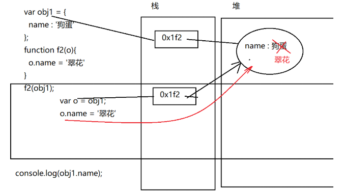

## JavaScript是什么

是一门运行在**浏览器**上的**脚本语言**

语言 = 语法 + 单词

语法：交流沟通的时候，一个固定的格式 —— 代码都是有固定格式——有语法规则的


## JavaScript分成3大部分

ECMAScript - 语法标准 - 6天

BOM - 浏览器对象模型 - 对象就是某一个具体的事物，我们可以让这个事物帮我们实现某个工作，而我们就可以不关注这个过程，只需要关注结果即可 - 就是把浏览器看成一个对象，指挥对象做事情

DOM - 文档对象模型 - 把文档(html页面)看成一个对象，也是指挥这个对象去做事情


DOM + BOM 就是js里面的API

## 变量的命名规则

1.能使用字母、数字、_、$ 

2.不能使用数字开头

3.不要使用关键字和保留字

关键字： var 这种 在js语法里面有特殊作用的

保留字：备胎，将来js的功能会越来越强大，会把一些候补的单词，变成关键字，为了以后你的程序不会出错，js里面预留了一些单词，可能会在将来变成关键字 - 查ECMAScript里面不同版本的保留字

一般正常的写名词作为变量，就不会出现和关键字和保留字冲突

4.区分大小写

以上四个是必须遵守的，有一些建议

5.命名要有意义

6.建议在js里面使用驼峰命名

变量名的第一个单词首字母小写，往后的每个单词都是大写

## 表达式

在程序中，只要能产生结构的，都叫表达式

## 语句

在程序中，可能一个程序由多个语句构成，每个语句就是程序里面的一个行为，只要是一个行为，就是一个语句

一个语句可能由多个表达式构成,一般每个语句于语句之间，习惯使用;分割

## 循环语句

循环语句解决重复的代码的问题

### while循环

语法：

```js
while (条件表达式){
  循环体
}
```

执行过程

1.执行条件表达式，判断是否为true

2.如果是false，直接终止循环，继续执行循环后面的代码

3.如果是true，就会执行循环体里面的代码

4.当循环体里面的代码执行完毕，继续判断条件表达式是为true

5.重复2-4的过程，直到条件表达式为false


### for循环

语法

```js
for (初始化表达式;条件表达式;自增或者减表达式){
  循环体
}
```

执行过程：

1.先执行初始化表达式

2.执行条件表达式，结果是true或者false

3.如果条件表达式的结果是false，会直接结束循环，继续执行循环后面的代码

4.否则执行循环体

5.当循环体执行完毕，再执行自增或者自减表达式

6.会继续判断条件表达式的结果是否让然成立，重复2-5的过程，直到条件表达式的结果是false


### do-while循环

语法

```js
do {
  循环体
}while (条件)
```

执行过程：

1.先执行一次循环体(不管条件是否成立)

2.再判断条件是否成立

3.如果不成立，直接结束

4.否则，就继续执行循环体

5.再次判断条件是否成立，一直重复2-4的步骤，直到条件的结果是false


### 三个循环

对比：

while        

可能一次都不执行 - 一般不会使用while - 如果非要使用，就是在不知道会执行多少次循环的情况下使用while

for		   

可能一次都不执行 - 一般开发都会使用for循环 - 一般就是可以明确的知道执行多少次循环的时候

do-while 

至少会执行一次 - 一般不会使用dowhile - 在不知道会执行多少次循环的情况下使用

### break的应用之一  —— 反证法

求一个数字n是否是一个质数

什么是质数： 一个数字，如果只能被1和自己本身整除，就是一个质数 ，比如： 7

思路：

从2开始，除到(n-1),如果都不整除，就是质数 —— 正面证明的方法

如果发现我们的某个问题从正面证明比较麻烦，就可以返回来证明 —— 反证法

反证法的步骤：

1.假设成立

2.循环的找反例

3.判断假设是否仍然成立

```js
var n = parseInt(prompt('请输入一个整数'));// 9
// 1 假设n是一个质数
var flag = true;//使用一个变量来表示假设是成立的
// 2 尝试找反例 - 只要证明从2到n-1之间，有1个数字是整除的即可
for(var i = 2; i <= n-1; i++){
  if(n % i === 0){
    // 只要满足条件，就证明了，有一个1和n本身以外的数字可以被整除 —— 推倒了假设
    flag = false;
    // 如果找打了反例，就后面的循环没有必要了
    break;
  }
}
// 3.看看flag到底是true还是false，如果还是true，就是没有找到反例，假设是成立的
if(flag){
  console.log('就是一个质数');
}else {
  console.log('不是一个质数');
}
```


## 遍历数组

把数组里面的每个数据，都访问一次，称为 —— 数组的遍历，一般就是使用for循环来实现

语法

```js
var sum = 0;
for(var i = 0; i < arr.length; i++){
  sum += arr[i];
}
console.log(sum);
```

## 预解析

是一个我们看不见的过程，这个过程把函数和变量的声明提升到最前面，把函数的调用，变量的赋值，还在原来的位置

有什么用？写代码可以更加的方便和随意

怎么用？不要手动的使用，享受这个福利就可以了

自己模拟一个手动的预解析

```js
// 我们看到的代码
f1(1,2);
function f1(a, b) {
  console.log(a + b);
}

f2(4,5);
var f2 = function (a, b) {
  console.log(a + b);
}
```

预解析之后的代码

```js
function f1(a, b) {
  console.log(a + b);
}
var f2;
f1(1, 2); 

f2(4, 5);
f2 = function (a, b) {
  console.log(a + b);
}
```

## 补充

### 匿名函数

是什么？没有名字的函数

有什么用？

1.函数表达式，2.后面的课程使用的事件里面有用，3.自调用函数里面，4.作为函数的参数存在

### 自调用函数

是什么？自动调用的函数

有什么用？ 解决全局污染的函数命名的问题

怎么用的？

```js
(function(){
  var aaaa = '狗蛋';
  console.log(aaaa);
})();
(function(){
  var aaaa = '翠花';
  console.log(aaaa);
})();
(function(){
  var aaaa = '铁蛋';
  console.log(aaaa);
})();
```

注意点： 多个自调用函数之间，需要分号隔开


### 函数也是一种数据类型

先证明函数也是一种数据类型

```js
function a(){} // 这是一个函数
console.log(typeof a); // 输出 function
```

函数如果也是数据类型，函数就可以作为参数

```js
function f1(a,fn){
  console.log(a);
  console.log(fn);
  fn();
}

function f2(){
  console.log('这里是f2里面的代码');
}

f1('abc',f2);
```

最终f2被执行了，说明，f2确实作为了f1的参数。后面很多其他的js里面提供的方法，都是以函数作为参数的。


### 回调函数

什么是回调函数： 以参数的形式传入另外一个函数的函数，然后在另一个函数的特定时机进行调用的函数

用法：

```js
function f1(a,fn){
  console.log(a);
  fn();
}
function f2(){
  console.log('f2');
}
f1('abc',f2);// f2就是f1的回调函数
```


### 短路运算

短路运算就是逻辑与和逻辑或的运算法则

如果逻辑或的左边，是true，会返回左边，如果是false，返回右边

如果逻辑语句的左边是true，会返回右边，如果是false，会返回左边

能用来干嘛：

逻辑与可以把回调函数的判断简写

```js
function f1(a,fn){
  console.log(a);
  fn && fn();
}
```

逻辑或可以用来给函数设置参数的默认值

```js
function getSum(a,b,c){
  a = a || 0;
  b = b || 0;
  c = c || 0;
  return a + b + c;
}
```

# 对象

什么是对象： 官方定义： 对象是多个键值对的集合

## 创建对象

语法：字面量的方式

```js
var obj = {};
```

语法：构造函数

```js
var obj = new Object()
```

语法：字面量初始化

```js
var obj = {
  属性名 : 属性值,
  属性名 : 属性值,
  ...
}
```

当方法里面的代码，比较多的时候，不建议这么写了

## 给对象添加属性和方法

语法

```js
对象.属性名 = 属性值;
对象.方法名 = function(){ 这个对象实现这个行为的具体的过程 }
```


## 访问对象的属性和方法

```js
// 访问属性
对象.属性名 - 相当于是一个变量

// 访问方法
对象.方法名();

// js里面还提供了一个 键 的方式 访问属性 - 就在for-in的时候可以使用
对象[键]
```


## 自定义构造函数

如果要批量的创建对象，代码应该是一样的，如果把这些代码封装到函数里面，重复的调用，是没有问题的

但是这个做法有一定的缺陷： 分不清创建出来的对象属于哪一种

在我们想要批量创建对象的时候，js里面推荐使用一个语法： 自定义构造函数

书写自定义构造函数的步骤：

1.把函数写出来，给一个大写字母开头的名字(人为约定的，区分和平时封装的函数)，要描述什么对象，就把这中对象的单词写过来

2.在函数的参数的位置，写你的对象所拥有的特征

3.把特征从形参变成对象的属性

4.如果对象有方法，继续给this添加方法

```js
// 大写的名词开头 // 把狗具有的特征作为形参
function Dog(name,age,gender,color){
  // 直接给this添加所有的属性
  this.name = name;
  this.age =age;
  this.gender = gender;
  this.color = color;
  // 给this添加方法
  this.run = function(){
    console.log('速度七十迈');
  }
  this.bark = function(){
    console.log('汪汪汪');
  }
}
```


## this关键字

this是一个关键字，它的作用是在函数中代表着函数中的一个对象，这个对象，如果是在构造函数里面，this指向被new出来的对象


## new关键字

new在创建对象的过程中，做了这么几件事情

​      1.先创建一个对象  相当于： a = new Object()

​      2.调用构造函数，把构造函数中的this 指向 上一步创建的对象 相当于：this = a;

​      3.依次执行构造函数中的代码，给this添加属性和方法

​      4.返回this所指向的对象  相当于：return this


## for-in遍历对象

```js
语法：
for-in
  key 是一个变量，代表了对象里面的所有的键
  obj 是你要遍历的对象
  for(var key in obj){
    可以使用key获取所有的属性名
    使用 obj[key] 获取所有的属性值
  }
例如：
var obj = {
  name : '狗蛋',
  age : 12,
  gender : '男'
};
for(var key in obj){
  console.log(key);
  console.log(obj[key]);
}
```


## 值类型和引用类型的不同

本质的区别：存储的位置不一样

值类型存储在栈空间里面，应用类型存储在堆空间里面


当我们以引用类型的变量赋值给另一个变量的时候，如果另一个发生改变了，之前的那个也会有影响

```js
var o1 = {
  name : '狗蛋'
}
var o2 = o1;
o2.name = '翠花';
console.log(o1.name,o2.name);
```


所以如果是引用类型作为参数传递的时候，会受到形参的影响

```js
var obj1 = {
  name : '狗蛋'
};
function f2(o){
  o.name = '翠花'
}
f2(obj1);
console.log(obj1.name);
```



所以现在就不能简单的说：实参不受形参的影响了，需要分情况

如果实参是值类型，实参不受形参的影响

如果实参是引用类型，实参是会受到形参的影响的

# 内置对象

## 学习Math的方法

Math.random()

​      方法的作用： 获取一个 [0,1) 之间的随机小数

​      方法的参数： 无

​      方法的返回值： 小数，所处的范围 [0,1)

```js
Math.random()
```


Math.floor(x)

方法的作用 ： 把一个数字向下取整

方法的参数 ：  x 是一个数字

方法的返回值 ： 返回小于等于x的最近的一个整数

```js
Math.floor( 45.95); // 45 
```


Math.ceil(x)

作用： 向上取整

参数： x是一个数字

返回值： 大于等于x的最小的整数

```js
Math.ceil(.95);    // 1
```


Math.round(x)

作用： 把数字四舍五入

参数：是一个数字

返回值：把数字四舍五入之后的整数

```js
Math.round(0.60) // 1
```


Math.abs(x)

作用： 给数字加上绝对值

参数：是一个数字

返回值：绝对值后的正整数

```js
Math.abs(-1) // 1
```


Math.max(x)

作用： 求多个数字里最大的数字

参数：是多个数字

返回值：一个数字

```js
Math.max(1,2,3,4) // 4
```

Math.min(x)

作用： 求多个数字里最小大的数字

参数：是多个数字

返回值：一个数字

```js
Math.min(1,2,3,4) // 1
```

## 创建自定义的时间对象-*活动的开始日期和结束日期*

```js
// new Date() 其实也是有参数的
// 第一种创建指定时间的用法
var date = new Date(年,月,日,时,分,秒);
```

作用： 创建指定日期的时间对象

参数：每个参数都是可以省略的，省略之后，默认值是0

年 - 指定的年份

月 ...

日

时

分

秒

返回值：就是一个指定日期的对象

```js
new Date(2019,6,1,8);
```

注意点：

月份是从0开始的

第二个方式可以直接给定一个日的字符串

```js
var date = new Date('年-月-日 时:分:秒');
例如：
new Date('2019-07-01 8:00:00');
```

第三个：

```js
var date = new Date(从1970年到指定日期所经过的毫秒数);
例如：
var date = new Date(1561692936706);
```


如果要比较日期的大小

我们如果要比较，把日期的总的毫秒数计算出来，再比较会好一点

date对象里面提供了一个获取从1970年1月1日到指定日期的所经过的所有的毫秒数，把毫秒数求出来之后，再比较

```js
var date = new Date()

// 获取总的毫秒数
date.getTime();

// 获取从1970年到指定日期的总的毫秒数
date.valueOf()
```

# 数组的方法

数组的push方法

```js
数组.push(e1,e2,e3...)
作用： 把一个或者多个元素从数组的末尾插入
参数：e1,e2,e3 就是每个要插入到数组末尾的元素
返回值： 数组的新长度
```

数组的pop方法

```js
数组.pop()
作用： 把元素从末尾拿出来
参数：没有
返回值：被拿出来的元素
```


数组.reverse()

```js
数组.reverse()
作用： 翻转数组
参数： 没有
返回值：被翻转的数组
```


数组的unshift方法

```js
数组.unshift(元素1，元素2)
作用： 把一个或者多个元素从数组的前面插入
参数： 多个要插入的元素
返回值： 新的数组的长度
```


数组的shift方法

```js
数组.shift();
作用： 从数组的最前面把一个元素取出来
参数： 没有
返回值： 被从前面移除的元素
```


数组的splice方法

```js
数组.splice(index,howmany,element1,element2，....)
作用： 可以用于 插入、删除、替换数组中元素
参数： 
	index 从哪里开始操作
  howmany 总共操作多少个元素
  elementn 用于插入或者是替换的新的元素
```


数组的遍历的forEach方法

```js
作用： 用于遍历数组
参数： 是一个函数，这个函数有两个形参，第一个形参代表了数组里面的每个元素，第二个形参代表了每个索引
返回值 ：返回值是undefined
例如：
var arr = [1,2,3,4,5];
var sum = 0;
var res = arr.forEach(function(e,i){
  sum += e;
};
```


数组的筛选的方法

```jsx
作用： 从数组中筛选出满足条件的元素，用一个新的数字装起来
参数： 是一个函数，函数有两个形参，第一个代表每个元素，第二个代表索引
返回值：是一个数组，里面有所有满足条件的元素
例如：
筛选出数组中满足条件的元素 ,条件就是 元素 > 2000
var arr = [3000,5000,100,80,99,2500];
var arr2 = arr.filter(function(e,i){
	return e > 2000;
})
```


数组的join方法

```js
作用： 把一个数组 ，用指定的分隔符，拼接成为一个字符串
参数： 就是一个指定的分隔符
返回值 ：是一个字符串
例如：
var resArr = ['张飞','关羽']
var res = resArr.join('^');
console.log(res); // 张飞^关羽
```

# 字符串的常用的方法

为什么字符串之类的值类型也可以调用方法

因为js在发现我们的值类型调用方法的时候，会自动监测这个值类型是否有对应的构造函数，如果有，会先创建一个临时对象，使用这个临时对象调用方法之后，再把对象销毁。

值类型里面只有数字、字符串、布尔是有构造函数的，所以字符串、数字、布尔是可以调用方法的，而null和undefined不能调用字符串的split方法

```js
作用： 根据一个指定的分隔符，把字符串，切割成为数组
参数： 指定的分隔符
返回值： 是一个数组
例如：
var str = '张飞|关羽|刘备|狗蛋';
var resArr = str.split('|');
console.log(resArr);
```


### 字符串的indexOf方法

```js
str.indexOf(char,fromIndex)
作用：查找某个字符在一个字符串中的位置
参数： 
	char 目标字符
  formIndex 从哪里开始查找
返回值：整数，如果是-1，代表没有，否则有，有就是返回某个字符所在的位置
```


### 字符串的substring方法

```js
字符串.substring(start,end)
作用：用来截取字符串的一部分
参数：
	start 从哪里开始截取
  end 到哪里结束，注意，这个end是获取不到的，如果就是要，请+1 ，如果省略，默认是字符串的最末尾
返回值：
	指定位置之间的字符
```


